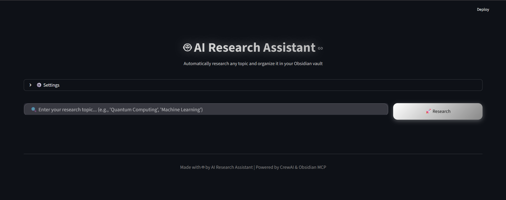

# VaultMind - AI-Powered Knowledge Building

**Automatically research any topic, format it beautifully, and organize it in your Obsidian vault.**

VaultMind is an intelligent research pipeline that combines AI agents, web search, and knowledge management to build your personal knowledge base automatically. Simply enter a topic, and watch as AI agents research, structure, and save professionally formatted notes to your Obsidian vault.



  

---

## ✨ Features

- 🔍 **Automated Web Research** - Uses Serper API to gather current information from the web
- 📝 **Professional Markdown Formatting** - Converts research into clean, structured Markdown
- 💾 **Obsidian Integration** - Automatically saves notes to your Obsidian vault via MCP
- 🎨 **Beautiful UI** - Glassmorphic black & white theme with real-time progress tracking
- 🔗 **Smart Organization** - Auto-tags, folder organization, and backlink creation
- 📊 **Live Streaming** - Watch agents work in real-time
- ⚙️ **Easy Configuration** - Built-in settings panel for API keys

---

## 🏗️ Architecture

```
User Input → Research Agent → Markdown Agent → Obsidian MCP Agent → Organized Vault
                ↓                    ↓                    ↓
           Web Search          Format & Structure    Save to Obsidian
```

### Agent Workflow:

1. **Research Agent** 🔍
   - Performs multiple web searches using Serper
   - Gathers information from reliable sources
   - Extracts key insights and references

2. **Markdown Agent** 📝
   - Converts raw research into structured Markdown
   - Creates proper headings, lists, tables
   - Formats citations and references

3. **Obsidian MCP Agent** 💾
   - Saves notes to your Obsidian vault
   - Organizes into appropriate folders
   - Adds tags and creates backlinks

---

## 🚀 Quick Start

### Prerequisites

- Python 3.9+
- Docker (for Obsidian MCP server)
- Obsidian with REST API plugin
- Serper API key ([Get one here](https://serper.dev/))

### Installation

1. **Clone the repository**
   ```bash
   git clone https://github.com/Unica2804/NoteWeaver.git
   cd vaultmind
   ```

2. **Install dependencies**
   ```bash
   pip install -r requirements.txt
   ```

3. **Set up environment variables**
   
   Create a `.env` file in the root directory:
   ```env
   SERPER_API_KEY=your_serper_api_key_here
   OBSIDIAN_HOST=host.docker.internal
   OBSIDIAN_API_KEY=your_obsidian_api_key_here
   CEREBRAS_API_KEY=your_cerebras_key_here  # Optional: if using Cerebras LLM
   ```

4. **Configure Obsidian**
   
   - Install the [Obsidian Local REST API](https://github.com/coddingtonbear/obsidian-local-rest-api) plugin
   - Enable the plugin and note your API key
   - Ensure the server is running and obsidian is open in the background

5. **Set up Obsidian MCP Docker**
   ```bash
   docker pull mcp/obsidian
   ```

---

## 💻 Usage

### Web Interface (Recommended)

Launch the beautiful Streamlit UI:

```bash
streamlit run app.py
```

Then:
1. ⚙️ Configure your API keys in the Settings panel (optional if .env is set)
2. 🔍 Enter your research topic
3. 🚀 Click "Research" and watch the magic happen!
4. 📂 Open your Obsidian vault to see the new note

### Command Line Interface

Run the CLI version:

```bash
python main.py
```

Follow the prompts to enter your research topic.


---

## 📁 Project Structure

```
vaultmind/
├── app.py                          # Streamlit UI
├── main.py                         # CLI interface
├── src/
│   ├── crew.py   # Main crew orchestration
│   ├── mcp_tool.py                    # Obsidian MCP tools
├── config/
│   ├── agents.yaml                # Agent configurations
│   └── tasks.yaml                 # Task definitions
├── logs/                          # Session logs
├── .env                           # Environment variables (create this)
├── requirements.txt               # Python dependencies
└── README.md                      # This file
```

---

## 🛠️ Configuration

### Agent Configuration (`config/agents.yaml`)

Define agent roles, goals, and behaviors:

```yaml
research_agent:
  role: Web Research Specialist
  goal: USE THE SERPER SEARCH TOOL to gather current information
  backstory: You are a web researcher who ALWAYS searches the internet...
```

### Task Configuration (`config/tasks.yaml`)

Define what each agent does:

```yaml
research_task:
  description: Research the topic using web search...
  expected_output: A comprehensive JSON object...
  agent: research_agent
```

---

## 🎨 UI Features

- **Glassmorphism Design** - Modern, beautiful black & white theme
- **Real-time Progress** - Live updates as agents work
- **Settings Panel** - Configure API keys without touching code
- **Output Streaming** - See research happen in real-time
- **One-Click Vault Access** - Button to open your Obsidian vault

---

## 🔧 Tech Stack

| Component | Technology |
|-----------|-----------|
| **AI Framework** | CrewAI |
| **LLM** | Cerebras Llama 3.3 (70B) |
| **Web Search** | Serper API |
| **Knowledge Management** | Obsidian + MCP |
| **UI Framework** | Streamlit |
| **Containerization** | Docker |

---

## 📊 Example Output

**Input:** "Machine Learning Basics"

**Generated Note:**
```markdown
---
tags: [machine-learning, ai, deep-learning, neural-networks]
---

# Machine Learning Basics

## Summary
Machine Learning is a subset of artificial intelligence that enables computers to learn from data...

## Key Concepts
- **Supervised Learning**: Training models with labeled data...
- **Unsupervised Learning**: Finding patterns in unlabeled data...

## References
1. [Introduction to Machine Learning](https://example.com) - Stanford University
2. [Deep Learning Fundamentals](https://example.com) - MIT
```

---

## 🤝 Contributing

Contributions are welcome! Please feel free to submit a Pull Request.

1. Fork the repository
2. Create your feature branch (`git checkout -b feature/AmazingFeature`)
3. Commit your changes (`git commit -m 'Add some AmazingFeature'`)
4. Push to the branch (`git push origin feature/AmazingFeature`)
5. Open a Pull Request

---

## 🐛 Troubleshooting

### Common Issues

**Issue: "Connection refused" to Obsidian**
- Solution: Ensure Obsidian REST API plugin is running
- Check that port 27124 is accessible
- Use `--network=host` in Docker args

**Issue: "Serper tool not being called"**
- Solution: Verify `SERPER_API_KEY` is set in .env
- Check that the research agent has the tool attached
- Review agent logs for tool execution

**Issue: "Docker MCP connection failed"**
- Solution: Pull the latest MCP image: `docker pull mcp/obsidian`
- Verify Docker is running
- Check Docker network settings

---

## 📝 Roadmap

- [ ] Support for multiple LLM providers (OpenAI, Anthropic, etc.)
- [ ] Batch processing for multiple topics
- [ ] Research history and caching
- [ ] Custom template support
- [ ] Graph view of generated knowledge base
- [ ] Export options (PDF, Word, etc.)
- [ ] Mobile app support

---

## 📄 License

This project is licensed under the MIT License 

---

## 🙏 Acknowledgments

- [CrewAI](https://www.crewai.com/) - Multi-agent orchestration
- [Serper](https://serper.dev/) - Web search API
- [Obsidian](https://obsidian.md/) - Knowledge management
- [Streamlit](https://streamlit.io/) - UI framework
- [Cerebras](https://cerebras.ai/) - Fast inference LLM

---

## 📧 Contact

**Project Maintainer:** Your Name

- GitHub: [@unica2804](https://github.com/Unica2804)
- Email: unicaofficial123@gmail.com

---

<p align="center">
  Made with 🤖 and ❤️ for the AI research community
</p>

<p align="center">
  <a href="#-vaultmind---ai-powered-knowledge-building">⬆️ Back to Top</a>
</p>
